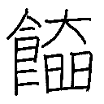

# Generating Novel Kanjis with Diffusion Model

In this project, I trained from scratch a pixel-level diffusion model to generate kanjis, which are Chinese characters used in Japanese, conditioned on their meaning. After training, we can give to the model a small description of a kanji that doesn't exist, and make it generate a plausible kanji corresponding to this description.

## Data

The data is based on kanjidic2 and KanjiVG taken from [here](https://github.com/Gnurou/tagainijisho).

## Code

The code is modified from HuggingFace diffusers example code of training a text-to-image stable diffusion [here](https://github.com/huggingface/diffusers/blob/main/examples/text_to_image/train_text_to_image.py). I modified the code so that I could train the model directly on the pixels rather than the latents produced by the VAE's encoder.

## Samples

Here are some interesting samples of novel kanjis generated by the model I trained.

<table>
  <tr>
    <td>
    <tr align="center">
      Deep learning
    </tr>
    <tr align="center">
      
    </tr>
    </td>
    <tr align="center">
      Bitcoin
       
      
    </tr>
    <td align="center">
      lol
       
      
    </td>
    <td align="center">
      Thank you
       
      
    </td>
    <td align="center">
      achieve enlightenment
       
      
    </td>
  </tr>
  <tr>
    <td align="center">
      paradise
       
      
    </td>
    <td align="center">
      Mount Fuji
       
      
    </td>
    <td align="center">
      plasma
       
      
    </td>
    <td align="center">
      the Big Bang
       
      
    </td>
    <td align="center">
      gravity
       
      
    </td>
    <td align="center">
      The answer to life, the universe, and everything
       
      
    </td>
    <td align="center">
      infinity
       
      
    </td>
    <td align="center">
      nightmare
       
      
    </td>
    <td align="center">
      a fluffy dog
       
      
    </td>
    <td align="center">
      Godzilla
       
      
    </td>
    <td align="center">
      Ultraman
       
      
    </td>
    <td align="center">
      samurai
       
      
    </td>
    <td align="center">
      rainbow unicorn
       
      
    </td>
    <td align="center">
      Jackie Chan
       
      
    </td>
    <td align="center">
      Twitter
       
      
    </td>
    <td align="center">
      Instagram
       
      
    </td>
    <td align="center">
      Dragon Ball
       
      
    </td>
    <td align="center">
      manga
       
      
    </td>
    <td align="center">
      Pikachu
       
      
    </td>
    <td align="center">
      Mewtwo
       
      
    </td>
    <td align="center">
      super hero
       
      
    </td>
    <td align="center">
      ramen
       
      
    </td>
    <td align="center">
      piano
       
      
    </td>
    <td align="center">
      arctic
       
      
    </td>
    <td align="center">
      antarctica
       
      
    </td>
    <td align="center">
      penguin
       
      
    </td>
    <td align="center">
      polar bear
       
      
    </td>
    <td align="center">
      crocodile
       
      
    </td>
    <td align="center">
      legendary sword
       
      
    </td>
    <td align="center">
      blood moon
       
      
    </td>
  </tr>
</table>

| Deep learning | Bitcoin | lol | Thank you | achieve enlightenment |
|:-------------:|:-------------:|:-------------:|:-------------:|:-------------:|
|  |  |  |  |  |